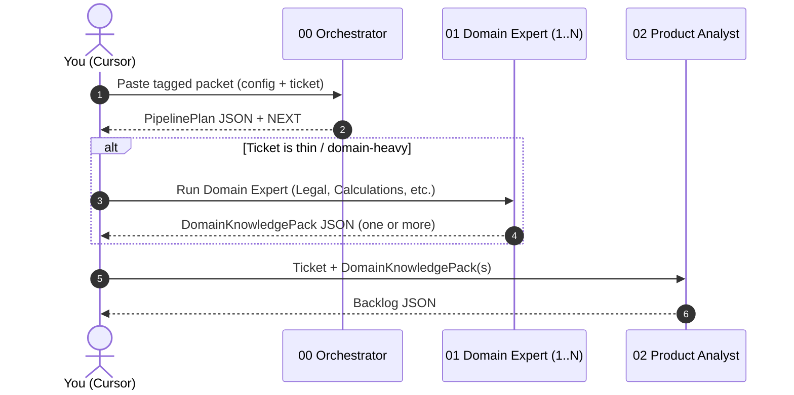

# SDLC Agents — XML Prompt Pack (Cursor)

This mini pack gives you **3 agents** in a consistent *tagged* prompt format:
- `00_orchestrator` (decides pipeline)
- `01_domain_expert` (produces DomainKnowledgePack)
- `02_product_analyst` (turns ticket + domain packs into Backlog)

Why tags?
- They separate **instructions vs context vs schema**, reducing “example poisoning” and format drift.
- They make copy/paste workflows in Cursor more reliable.

---

## Folder structure
- `agents/` agent prompts
- `schemas/` JSON schemas (contracts)
- `examples/` blob vs tagged scenario

---

## Quick start in Cursor

### 1) Orchestrator (interactive default)
Open `agents/00_orchestrator.md`, copy the XML template, fill `<config>` and paste your ticket.

Expected output:
- **PipelinePlan JSON**
- a single line: `NEXT: <agent_id>`

### 2) Domain Expert (when ticket is thin / domain-heavy)
Open `agents/01_domain_expert.md`.
Run **one or more** experts (e.g. Payroll Legal + Payroll Calculations).
You’ll get `DomainKnowledgePack` JSON.

### 3) Product Analyst
Open `agents/02_product_analyst.md`.
Paste:
- raw ticket
- the DomainKnowledgePack(s)
Get a `Backlog` JSON ready for engineering.

---

## Scenario: blob vs tagged (illustrative)

We included:
- `examples/prompt_blob.txt` — unstructured “blob prompt”
- `examples/prompt_tagged.xml` — tagged contract prompt
- `examples/illustrative_bad_output.json` — typical failure mode (format drift)
- `examples/illustrative_good_output.json` — what “good” looks like

**How to use this in practice**
- Run 10 times with the blob prompt → count format breaks.
- Run 10 times with the tagged prompt → compare format-break rate.

---

## Mermaid sequence (this mini pack)

Generated: 2025-12-26
