# SDLC Multi‑Agent Pipeline for Cursor (Rails + Laravel)

This repo is a **copy‑paste friendly** multi-agent workflow:
- A single **Orchestrator** decides which agents to run for a ticket.
- Every agent uses a **standard input/output contract** (JSON schemas).
- Works for **Jira** or **Linear** tickets by pasting the ticket text.

> You can use these by **pasting the prompt content directly into Cursor chat** or as templates to keep consistent workflows across teams.

## Folder layout
- `agents/` — the agent prompts (Markdown)
- `schemas/` — JSON schemas for standardized outputs
- `templates/` — pipeline plan template
- `examples/` — sample ticket + sample structured outputs
- `docs/` — additional documentation
- `.cursor/rules/` — Cursor rules (team-wide behavior)

## Documentation

**Quick Start:**
- [`docs/HOW_TO_USE_IN_CURSOR.md`](docs/HOW_TO_USE_IN_CURSOR.md) - How to use in Cursor IDE

**Agent Reference:**
- [`AGENTS.md`](AGENTS.md) - Complete reference for all agents, roles, inputs, outputs, and workflows

**Workflow Guides:**
- [`docs/COMMAND_WORKFLOW.md`](docs/COMMAND_WORKFLOW.md) - Command workflow (prime/plan/execute/commit)
- [`docs/SDLC_SEQUENCE_DIAGRAM.md`](docs/SDLC_SEQUENCE_DIAGRAM.md) - Sequence diagrams showing orchestrator flow

**Team Rules:**
- [`.cursor/rules/sdlc_pipeline.md`](.cursor/rules/sdlc_pipeline.md) - Team-wide rules and conventions

## 🚀 Quick Start: How to Use in Cursor

**👉 Start here:** [`docs/HOW_TO_USE_IN_CURSOR.md`](docs/HOW_TO_USE_IN_CURSOR.md)

This guide shows you **exactly** how to:
- **Option 1:** Just paste the orchestrator content (works immediately, no setup) - **Recommended**
- **Option 2:** Use Custom Commands if available (optional)
- **Option 3:** Use the sync script for team standardization

**TL;DR:** Open `agents/00_orchestrator.md`, copy all content, paste into a Cursor chat, add your ticket, and go!

## Team workflow (recommended)

### 1) Create a run folder first (prevents data loss)

```bash
python3 scripts/new_run.py --ticket PROJ-123 --title "short title"
```

Put your raw ticket text in `runs/.../ticket.txt`.

Tip: you can also use the Makefile shortcuts:

```bash
make run-init TICKET=PROJ-123 TITLE="short title"
make validate-run RUN=runs/PROJ-123_short-title_YYYYMMDD_HHMMSS
make help
```

### 2) Run agents in Cursor (JSON-only)

Run `00_orchestrator` first, then follow the phases. Each agent must return **ONLY JSON** that validates against the schema it references.

### 3) Validate outputs (required)

Validate single files:

```bash
python3 scripts/validate_json_schema.py schemas/ticket_context.schema.json runs/.../ticket_context.json
python3 scripts/validate_json_schema.py schemas/spec.schema.json runs/.../spec.json
```

Validate a whole run folder:

```bash
python3 scripts/validate_run.py runs/PROJ-123_short-title_20260115_120000
```

### 4) One-message mode: split into files (recommended)

If you run `mode=one_message`, save the returned JSON bundle to `runs/.../bundle.json`, then split it:

```bash
python3 scripts/split_one_message_bundle.py runs/.../bundle.json runs/PROJ-123_short-title_20260115_120000
```

### 5) Domain scaffolding: materialize files (mandatory)

When `01x_domain_agent_scout` returns `materialize.files[]`, create those files in the repo:

```bash
python3 scripts/apply_materialize.py runs/.../01x_domain_scaffold.json
```

## Cursor rules

This repo includes team-wide rules under:
- `.cursor/rules/sdlc_pipeline.md`

They enforce JSON-only outputs, schema validation, run-folder persistence, and domain materialization.

## Command workflow (prime/plan/execute/commit)

For a simple, memorable workflow that maps directly to the orchestrator + agents (inspired by the “command set” approach in [`masta-g3/rules`](https://github.com/masta-g3/rules)):

- See: `docs/COMMAND_WORKFLOW.md`

## Multi-session velocity: `features.json`

For larger epics (multiple devs, multiple sessions), track work in a lightweight `features.json`:

1) Initialize:

```bash
python3 scripts/features.py init --project-id PROJ-123 --title "short title" --out features.json
```

2) After you generate `backlog.json`, import stories:

```bash
python3 scripts/features.py import-backlog runs/.../backlog.json --features features.json --run-dir runs/PROJ-123_short-title_YYYYMMDD_HHMMSS
```

3) Pick next ready:

```bash
python3 scripts/features.py next --features features.json
```

Schema:
- `schemas/features.schema.json`

## Sharing prompts/rules with developers (sync)

To give every developer the exact same prompts + rules in a local folder:

```bash
./scripts/sync_cursor_assets.sh --dest "$HOME/.cursor/sdlc" --force
```

This creates:
- `$HOME/.cursor/sdlc/agents/` (prompts)
- `$HOME/.cursor/sdlc/rules/` (rules)
- `$HOME/.cursor/sdlc/schemas/` (schemas)

## Agent Reference

**👉 Complete agent documentation:** [`AGENTS.md`](AGENTS.md)

Quick reference:
- **00** - Orchestrator (start here)
- **01** - Ticket Reader
- **02** - Product Analyst
- **03/03A/03B/03C** - Architects (Generic/Rails/Laravel/Frontend)
- **04** - QA Designer
- **05** - Security Reviewer
- **06** - Performance & Observability
- **07A/07B/07C** - Implementers (Rails/Laravel/Frontend)
- **07T** - Test Writer (TDD)
- **07W** - Code Writer
- **08** - Code Reviewer
- **08A** - Spec Compliance Validator
- **08B** - Spec Diff Analyzer
- **08C** - Test Coverage Validator
- **09** - Release & Ops

See [AGENTS.md](AGENTS.md) for complete details, roles, inputs, outputs, and workflows.

## Standard contracts
All JSON outputs should validate against schemas in `/schemas/`:
- `ticket_context.schema.json` - Agent 01
- `backlog.schema.json` - Agent 02
- `codebase_architecture.schema.json` - Agent 00A
- `integration_plan.schema.json` - Agent 02A
- `data_migration_plan.schema.json` - Agent 02B
- `spec.schema.json` - Agents 03, 03A, 03B, 03C
- `test_suite.schema.json` - Agent 04
- `test_code_set.schema.json` - Agent 07T
- `code_change_set.schema.json` - Agent 07W
- `spec_compliance_report.schema.json` - Agent 08A
- `spec_diff_report.schema.json` - Agent 08B
- `test_coverage_report.schema.json` - Agent 08C
- `pipeline_plan.schema.json` - Agent 00
- `domain_scaffold.schema.json` - Agent 01X
- `domain_knowledge_pack.schema.json` - Domain experts
- `features.schema.json` - Multi-session tracking

## Example run
Use the included example ticket:

- Raw ticket: `examples/jira_linear/ticket_raw.txt`
- Example TicketContext: `examples/jira_linear/ticket_context.json`

### Suggested Pipeline Workflows

**Standard Feature (Rails/Laravel):**
1) 00_orchestrator (start here)  
2) 01_ticket_reader  
3) 02_product_analyst (if scope > 1 story)  
4) 00a_codebase_analyzer (if new codebase)  
5) 03A (Rails) or 03B (Laravel)  
6) 05_security_privacy (if auth/PII/tenancy)  
7) 06_perf_observability (if performance-sensitive)  
8) 04_qa_designer  
9) 07A/07B implementer (optional)  
10) 07w_code_writer  
11) 08a_spec_compliance_validator  
12) 08c_test_coverage_validator  
13) 08_code_reviewer  
14) 09_release_ops (if risky)

**TDD Workflow (recommended):**
1) 00_orchestrator  
2) 01_ticket_reader  
3) 02_product_analyst  
4) 03A/03B architect  
5) 04_qa_designer  
6) **07t_test_writer** (write tests first)  
7) **08c_test_coverage_validator** (validate coverage)  
8) 07A/07B implementer (make tests pass)  
9) 07w_code_writer  
10) 08c_test_coverage_validator (final check)  
11) 08a_spec_compliance_validator  
12) 08_code_reviewer

**Integration Workflow:**
1) 00_orchestrator  
2) 01_ticket_reader  
3) 02a_integration_planner  
4) 02_product_analyst  
5) 03A/03B architect  
6) 04_qa_designer  
7) 07t_test_writer  
8) 08c_test_coverage_validator  
9) 07A/07B implementer  
10) 07w_code_writer  
11) 08c_test_coverage_validator  
12) 08_code_reviewer

See [AGENTS.md](AGENTS.md) for complete workflow details.

## Adding a new agent
Create a new prompt in `agents/` and ensure:
- It consumes one of the existing JSON outputs (or raw ticket text).
- It outputs JSON matching an existing schema (or add a new schema).
- It lists concrete `files_touched` when proposing code changes.
- Update [AGENTS.md](AGENTS.md) with the new agent documentation.

## Notes for Jira/Linear
If you can paste the ticket as text, Agent 01 is enough.
If you have API access, you can later add a small fetch script, but this repo keeps things **tool-agnostic** so it works anywhere.

---

Generated: 2025-12-25


## PipelinePlans by Conventional Commit type

You asked for **ready-to-use PipelinePlan examples** for common ticket types (mapped to conventional commits).

They live in:
- `examples/pipeline_plans/`  
  e.g. `examples/pipeline_plans/rails_feat.pipeline_plan.json`

### What PipelinePlan means in Cursor
A `PipelinePlan` is just a **runbook**: it tells you which agent to run next and what to paste.

**You do not need an external orchestrator tool.** The orchestrator is just another Cursor agent prompt.

### How to use this in Cursor (step-by-step)

1) **Copy the orchestrator prompt**
- Open `agents/00_orchestrator.md` in Cursor
- Copy the entire content (`Cmd+A`, `Cmd+C` / `Ctrl+A`, `Ctrl+C`)

2) **Run the Orchestrator**
- Open the Jira/Linear ticket.
- Copy **title + description + key comments**.
- In Cursor chat, paste the orchestrator prompt, then add:

Example (Rails + feat):
```
stack=rails
commit_type=feat

TICKET:
<PASTE JIRA/LINEAR TEXT HERE>
```

The orchestrator should return a **PipelinePlan JSON**.

3) **Execute the plan**
- Run each agent listed in the plan **in order**.
- For each step:
  - Copy the **JSON output** from the previous agent
  - Paste it as input to the next agent (no extra prose)

4) **Implementation workflow**
- After you have the final `DeveloperReadySpec` + `TestSuite`,
  run `07A/07B Implementer` to get a file-by-file edit plan.
- Apply the edits in the editor (Cursor).
- Then run `08 Code Reviewer` with:
  - the final spec JSON
  - the diff/changed files
  - test output (if available)

### Using the generator script (optional)
If you want a quick starting PipelinePlan without running the orchestrator first:

```bash
python scripts/generate_pipeline_plan.py --stack rails --type feat > pipeline_plan.json
python scripts/generate_pipeline_plan.py --stack laravel --type fix > pipeline_plan.json
python scripts/generate_pipeline_plan.py --stack rails --type perf > pipeline_plan.json
```

Then follow the plan manually by running those agents in Cursor.

### When should you still use the Orchestrator?
- When the ticket is ambiguous and needs assumptions/questions.
- When you suspect multiple stories are hidden in one ticket.
- When you want the pipeline to auto-add Security/Perf/Release phases based on content.

### Mapping cheat sheet
- `feat` → use Backlog + Spec + QA + Implement + Review (+ Release)
- `fix` → Spec + QA + Implement + Review (+ Security if auth/tenancy)
- `refactor` → Spec (light) + QA (focus regression) + Review
- `perf` → Spec + Perf/Obs + QA + Review (+ Release if risky)
- `style`/`test`/`docs` → minimal pipeline (often skip backlog)

Generated: 2025-12-25


## Frontend agent (FE)

Added:
- `agents/03c_architect_frontend.md` — FE spec generator
- `agents/07c_implementer_frontend.md` — FE implementer

### When to run FE agents
- The ticket touches **UI**, **UX**, **forms**, **client-side validation**, **routing**, **state**, or **frontend performance**.
- Or when the BE change requires coordinated FE updates (new endpoint, new payload, etc.).

### Minimal FE pipeline (example)
1) 01 Ticket Reader  
2) 03A/03B BE Architect (if API changes)  
3) 03C FE Architect  
4) 04 QA  
5) 07C FE Implementer (optional)  
6) 08 Reviewer

### Less copy/paste: "One-message Orchestrator" mode
In Cursor, ask the orchestrator to return everything in one JSON bundle.

Example prompt:
```
stack=laravel
commit_type=feat
mode=one_message

Run the pipeline end-to-end and return ONE JSON with:
- ticket_context
- backlog (only if needed)
- spec (include BE + FE implementation_plan)
- test_suite

TICKET:
<paste jira/linear ticket>
```


## Output organization (avoid overwrites)

If you reuse the same agents across multiple projects, **do not write outputs to a single shared `output/` folder**.
Instead, store each run under a unique folder keyed by **ticket id + short slug + timestamp**.

Recommended structure:
- `runs/<TICKET>_<short-slug>_<YYYYMMDD_HHMMSS>/`
  - `ticket.txt` (raw pasted ticket)
  - `pipeline_plan.json`
  - `ticket_context.json`
  - `spec.json`
  - `test_suite.json`

This prevents overwrites and makes it easy to compare runs.

### Quick run creation
Create a run folder skeleton:
```bash
python scripts/new_run.py --ticket PROJ-123 --title "SSO email mismatch"
```

Generate a plan into a unique folder (no overwrite):
```bash
python scripts/generate_pipeline_plan.py --stack rails --type feat --ticket PROJ-123 --title "SSO email mismatch"
# prints the path to runs/.../pipeline_plan.json
```

### Git hygiene
This repo includes a `.gitignore` entry for `runs/*` so you can keep runs local.
If you *do* want to commit certain runs (for audits), remove that line or move the run into a tracked folder.

Generated: 2025-12-26


### Orchestrator modes
- **interactive (default):** Orchestrator returns a `PipelinePlan`. You run each agent step-by-step.
- **one_message:** Orchestrator returns a single combined JSON bundle: `ticket_context`, optional `backlog`, `spec`/`specs`, `test_suite`/`test_suites`.

Example (one_message):
```
stack=rails
commit_type=fix
mode=one_message

Run the pipeline end-to-end and return ONE JSON bundle.

TICKET:
<paste jira/linear ticket>
```

Generated: 2025-12-26


## Integration & Platform Planner (02A)

Added:
- `agents/02a_integration_planner.md` — identifies service boundaries + contracts + integration risks
- `schemas/integration_plan.schema.json`

### Where it fits in the pipeline
Run it **after Ticket Reader** and **before Backlog** when the ticket involves other services or creating a new service:

1) 01 Ticket Reader → `TicketContext`  
2) 02A Integration Planner → `IntegrationPlan`  
3) 02 Product Analyst → backlog includes explicit integration stories + dependencies  
4) Architect(s) → specs align to integration contracts  

### Orchestrator (interactive) prompt example
```
stack=rails
commit_type=feat
mode=interactive

Ticket affects other services. Include IntegrationPlan.
TICKET:
<paste ticket>
```

Generated: 2025-12-26


## Data Migration Strategist (02B)

Added:
- `agents/02b_data_migration_strategist.md`
- `schemas/data_migration_plan.schema.json`

### Where it fits
Run after Ticket Reader (and after Integration Planner if applicable):

1) 01 Ticket Reader → `TicketContext`  
2) 02A Integration Planner → `IntegrationPlan` (optional)  
3) 02B Data Migration Strategist → `DataMigrationPlan` (optional but recommended for migrations)  
4) 02 Product Analyst → backlog includes migration tasks + dependencies  
5) Architects → specs align to phased migration plan  

Generated: 2025-12-26


## Additional SDLC agents

### 02C — Domain Modeler
Clarifies entities, invariants, and domain rules before design.

### 02D — Risk & Rollout Planner
Defines feature flags, rollout phases, metrics, and rollback triggers.

### 03D — Contract Validator
Normalizes API/event contracts for BE/FE and integrations.

These agents are **conditional** and only used when the ticket complexity warrants them.

Generated: 2025-12-26


## Migration Modernization Auditor (02E)

Added:
- `agents/02e_migration_modernization_auditor.md`

### Why this exists
When extracting/migrating from a monolith, the danger is doing a *lift-and-shift* of legacy coupling and anti-patterns.
02E forces a **target-state design** and framework best practices (Rails/Laravel) so the new service improves quality rather than preserving debt.

### Where it fits
1) 01 Ticket Reader  
2) 02A Integration Planner (optional)  
3) 02B Data Migration Strategist (migration/backfill/cutover)  
4) **02E Modernization Auditor (avoid legacy anti-patterns)**  
5) Architects (03A/03B/03C) finalize specs  
6) QA + Implement + Review + Release  

Generated: 2025-12-26


## Domain Expert (suggested) — Option A

Added: `templates/domain_expert_agent_prompt.md`

Use when ticket requirements are ambiguous or written by someone without deep domain knowledge (Payroll, Recruitment, Employee Admin, etc.).
Run it **after** Ticket Reader and **before** Product Analyst so backlog and specs reflect correct domain rules.

Generated: 2025-12-26


## DomainKnowledgePack (formal schema)

Added:
- `schemas/domain_knowledge_pack.schema.json`
- `templates/domain_expert_payroll_split.md`

Agent 02 (Product Analyst) now explicitly accepts one or multiple `DomainKnowledgePack` inputs and must weave rules/edge cases into backlog acceptance criteria.

Generated: 2025-12-26


## How it works (high-level)

**📊 [View detailed sequence diagram →](docs/SDLC_SEQUENCE_DIAGRAM.md)** (shows orchestrator flow, domain creation, human-in-the-loop)

You run this inside **Cursor** using the **Orchestrator** plus specialized agents.  
The Orchestrator decides which agents to run based on the ticket and your `stack` + `commit_type`.

### Complete Pipeline Flow (Interactive vs One-Message Mode)

```mermaid
sequenceDiagram
    participant Human as 👤 Human Developer
    participant Cursor as 💻 Cursor IDE
    participant Orch as 🤖 Orchestrator<br/>(Agent 00)
    participant RunFolder as 📁 Run Folder
    participant DomainScout as 🔍 Domain Scout<br/>(Agent 01X)
    participant TicketReader as 📋 Ticket Reader<br/>(Agent 01)
    participant ProductAnalyst as 📊 Product Analyst<br/>(Agent 02)
    participant Architect as 🏗️ Architect<br/>(Agent 03)
    participant CodeWriter as 💻 Code Writer<br/>(Agent 07W)
    participant DomainFiles as 📂 Domain Templates

    Note over Human, DomainFiles: SDLC Pipeline Flow

    Human->>Cursor: Paste ticket + config<br/>(stack, commit_type, mode)
    Cursor->>Orch: Execute Orchestrator
    
    Orch->>RunFolder: Create run folder<br/>runs/TICKET_slug_timestamp/
    
    alt Interactive Mode
        Orch->>Orch: Analyze ticket<br/>Determine agent sequence
        Orch->>RunFolder: Save pipeline_plan.json
        Orch->>Human: Return PipelinePlan<br/>(JSON with agent steps)
        Human->>Human: Review plan
        Human->>Cursor: Execute Agent 01 (Ticket Reader)
        Cursor->>TicketReader: Run with ticket
        TicketReader->>RunFolder: Save ticket_context.json
        TicketReader->>Human: Return TicketContext
        
        Human->>Cursor: Execute Agent 01X (if needed)
        Cursor->>DomainScout: Run Domain Scout
        DomainScout->>Orch: Return DomainScaffold<br/>(with materialize.files[])
        Orch->>DomainFiles: Create domain templates<br/>README.md, prompt.md, examples/
        Orch->>RunFolder: Save domain scaffold JSON
        Note over Orch, DomainFiles: MANDATORY<br/>Auto-materialization
        
        Human->>Cursor: Execute Agent 02 (Product Analyst)
        Cursor->>ProductAnalyst: Run with TicketContext<br/>+ DomainKnowledgePack (if exists)
        ProductAnalyst->>RunFolder: Save backlog.json
        ProductAnalyst->>Human: Return Backlog
        
        Human->>Cursor: Execute Agent 03 (Architect)
        Cursor->>Architect: Run with Backlog
        Architect->>RunFolder: Save spec.json
        Architect->>Human: Return DeveloperReadySpec
        
        Human->>Cursor: Execute Agent 07W (Code Writer)
        Cursor->>CodeWriter: Run with Spec
        CodeWriter->>RunFolder: Write code files
        CodeWriter->>Human: Return implementation
        
    else One-Message Mode
        Orch->>Orch: Analyze ticket<br/>Determine agent sequence
        Orch->>RunFolder: Save pipeline_plan.json
        
        Orch->>TicketReader: Execute Agent 01
        TicketReader->>RunFolder: Save ticket_context.json<br/>(incremental save)
        TicketReader->>Orch: Return TicketContext
        
        alt New Domain Detected
            Orch->>DomainScout: Execute Agent 01X
            DomainScout->>Orch: Return DomainScaffold<br/>(with materialize.files[])
            Orch->>DomainFiles: Create domain templates<br/>README.md, prompt.md, examples/
            Orch->>RunFolder: Save domain scaffold JSON
            Note over Orch, DomainFiles: MANDATORY<br/>Auto-materialization
        end
        
        Orch->>ProductAnalyst: Execute Agent 02
        ProductAnalyst->>RunFolder: Save backlog.json<br/>(incremental save)
        ProductAnalyst->>Orch: Return Backlog
        
        Orch->>Architect: Execute Agent 03
        Architect->>RunFolder: Save spec.json<br/>(incremental save)
        Architect->>Orch: Return DeveloperReadySpec
        
        Orch->>CodeWriter: Execute Agent 07W
        CodeWriter->>RunFolder: Write code files
        CodeWriter->>Orch: Return implementation
        
        Orch->>RunFolder: Save complete bundle.json
        Orch->>Human: Return complete JSON bundle<br/>(all artifacts)
    end
    
    Note over Human, DomainFiles: All artifacts saved in run folder<br/>Ready for validation & commit
```



### Modes
- **interactive (default):** Orchestrator returns a `PipelinePlan`; you run agents step-by-step.
- **one_message:** Orchestrator returns a single JSON bundle (`ticket_context`, optional `backlog`, `spec/specs`, `test_suite/test_suites`, and optional integration/migration artifacts).

### Typical sequence (Mermaid)


### What you paste in Cursor (quick templates)

**Interactive (default):**
```
stack=rails
commit_type=fix
mode=interactive

Here is the ticket. Build a PipelinePlan and tell me the next agent to run.

TICKET:
<paste Jira/Linear ticket>
```

**One-message (no handoff):**
```
stack=laravel
commit_type=feat
mode=one_message

Run the pipeline end-to-end and return ONE JSON bundle with:
- ticket_context
- backlog (only if needed)
- spec (include BE + FE if UI impacted)
- test_suite
- integration_plan / data_migration_plan / modernization_plan if applicable

TICKET:
<paste Jira/Linear ticket>
```


---

## XML-Structured Prompting (recommended)

Added: `templates/xml_prompting_guide.md`

If you saw the Anthropic XML-tags idea: yes, it's useful here.
It reduces “blob prompt” ambiguity by separating **instructions vs context vs schemas**.

Start here:
- `templates/xml_prompting_guide.md`
Examples:
- `examples/xml_vs_blob/` (blob vs tagged)

Generated: 2025-12-26


---

## 07W — Code Writer (actually edits files)

If your pipeline ends with an **ImplementationPlan** but no code was written, that’s expected:
- Implementer agents plan.
- **07W writes**.

Added:
- `agents/07w_code_writer.md`

How to use:
1) Run Architect + QA + Implementer(s) until you have ImplementationPlan JSON(s).
2) Run **07W** with those JSONs pasted in.
3) Then run 08 (review) and 09 (release).

Generated: 2025-12-28


---

## Domain templates (scalable structure)

We group domain-specific experts under:

- `templates/domains/<domain>/`
- `templates/domains/<domain>/examples/`

Payroll specialists added:
- `templates/domains/payroll/domain_expert_payroll_mx_imss.md`
- `templates/domains/payroll/domain_expert_payroll_mx_infonavit.md`

To propose new domain specialists:
- `agents/01x_domain_agent_scout.md`

Generated: 2025-12-28


---

## Estructura por dominio (simple y plana)

Para evitar redundancia, usamos una estructura **plana por dominio**:

- `sdlc/templates/domains/<domain>/*.md` → agentes/prompts de dominio
- `sdlc/templates/domains/<domain>/examples/*.json` → ejemplos DomainKnowledgePack
- `sdlc/templates/domains/_shared/*.md` → prompts compartidos

Ejemplo Payroll:
- `sdlc/templates/domains/payroll/domain_expert_payroll_mx_imss.md`
- `sdlc/templates/domains/payroll/examples/domain_knowledge_pack_payroll_mx_imss.json`

Generated:
 2025-12-28


---

## 01X "materialize" (crear nuevos agentes de dominio automáticamente)

El Domain Agent Scout (01X) **DEBE materializar** nuevos agentes de dominio automáticamente, entregando:
- el **template .md** del agente (prompt listo para copiar)
- un **example DomainKnowledgePack .json** (forma esperada del output)

Estructura:
- `sdlc/templates/domains/<domain>/*.md`
- `sdlc/templates/domains/<domain>/examples/*.json`

### Materialización automática (MANDATORIA)

El orchestrator **DEBE** crear automáticamente todos los archivos listados en `materialize.files[]` cuando 01X retorna su output. Esto no es opcional - los archivos se crean como parte del pipeline.

El script `scripts/apply_materialize.py` está disponible para uso manual si es necesario, pero el orchestrator debe crear los archivos automáticamente.

Generated: 2025-12-28

Tip: `chmod +x scripts/apply_materialize.py` if you want to run it directly.
