# SDLC Pipeline Sequence Diagram

This diagram shows the complete flow of the SDLC pipeline, including orchestrator decision-making, domain expert creation, and human-in-the-loop interactions.

## Quick Summary

The SDLC pipeline operates in two modes:

- **Interactive Mode**: Human reviews and executes each agent step-by-step
- **One-Message Mode**: Orchestrator runs the entire pipeline automatically with incremental saves

Key features:
- **Automatic domain creation**: When a new domain is detected, Domain Scout (01X) creates the complete structure and files are automatically materialized
- **Incremental saving**: All artifacts are saved immediately to prevent data loss
- **Run folder organization**: All outputs go to `runs/TICKET_slug_timestamp/`
- **Human-in-the-loop**: Full control in interactive mode, review in one-message mode

## Interactive Diagram

[View in FigJam](https://www.figma.com/online-whiteboard/create-diagram/28b28dec-3bfa-46fb-a1b4-25817e7c7d7a?utm_source=other&utm_content=edit_in_figjam&oai_id=&request_id=d7d86492-669c-4cbe-9724-12744ef388bb)

## Mermaid Source

```mermaid
sequenceDiagram
    participant Human as 👤 Human Developer
    participant Cursor as 💻 Cursor IDE
    participant Orch as 🤖 Orchestrator<br/>(Agent 00)
    participant RunFolder as 📁 Run Folder
    participant DomainScout as 🔍 Domain Scout<br/>(Agent 01X)
    participant TicketReader as 📋 Ticket Reader<br/>(Agent 01)
    participant ProductAnalyst as 📊 Product Analyst<br/>(Agent 02)
    participant Architect as 🏗️ Architect<br/>(Agent 03)
    participant CodeWriter as 💻 Code Writer<br/>(Agent 07W)
    participant DomainFiles as 📂 Domain Templates

    Note over Human, DomainFiles: SDLC Pipeline Flow

    Human->>Cursor: Paste ticket + config<br/>(stack, commit_type, mode)
    Cursor->>Orch: Execute Orchestrator
    
    Orch->>RunFolder: Create run folder<br/>runs/TICKET_slug_timestamp/
    
    alt Interactive Mode
        Orch->>Orch: Analyze ticket<br/>Determine agent sequence
        Orch->>RunFolder: Save pipeline_plan.json
        Orch->>Human: Return PipelinePlan<br/>(JSON with agent steps)
        Human->>Human: Review plan
        Human->>Cursor: Execute Agent 01 (Ticket Reader)
        Cursor->>TicketReader: Run with ticket
        TicketReader->>RunFolder: Save ticket_context.json
        TicketReader->>Human: Return TicketContext
        
        Human->>Cursor: Execute Agent 01X (if needed)
        Cursor->>DomainScout: Run Domain Scout
        DomainScout->>Orch: Return DomainScaffold<br/>(with materialize.files[])
        Orch->>DomainFiles: Create domain templates<br/>README.md, prompt.md, examples/
        Orch->>RunFolder: Save domain scaffold JSON
        Note over Orch, DomainFiles: MANDATORY<br/>Auto-materialization
        
        Human->>Cursor: Execute Agent 02 (Product Analyst)
        Cursor->>ProductAnalyst: Run with TicketContext<br/>+ DomainKnowledgePack (if exists)
        ProductAnalyst->>RunFolder: Save backlog.json
        ProductAnalyst->>Human: Return Backlog
        
        Human->>Cursor: Execute Agent 03 (Architect)
        Cursor->>Architect: Run with Backlog
        Architect->>RunFolder: Save spec.json
        Architect->>Human: Return DeveloperReadySpec
        
        Human->>Cursor: Execute Agent 07W (Code Writer)
        Cursor->>CodeWriter: Run with Spec
        CodeWriter->>RunFolder: Write code files
        CodeWriter->>Human: Return implementation
        
    else One-Message Mode
        Orch->>Orch: Analyze ticket<br/>Determine agent sequence
        Orch->>RunFolder: Save pipeline_plan.json
        
        Orch->>TicketReader: Execute Agent 01
        TicketReader->>RunFolder: Save ticket_context.json<br/>(incremental save)
        TicketReader->>Orch: Return TicketContext
        
        alt New Domain Detected
            Orch->>DomainScout: Execute Agent 01X
            DomainScout->>Orch: Return DomainScaffold<br/>(with materialize.files[])
            Orch->>DomainFiles: Create domain templates<br/>README.md, prompt.md, examples/
            Orch->>RunFolder: Save domain scaffold JSON
            Note over Orch, DomainFiles: MANDATORY<br/>Auto-materialization
        end
        
        Orch->>ProductAnalyst: Execute Agent 02
        ProductAnalyst->>RunFolder: Save backlog.json<br/>(incremental save)
        ProductAnalyst->>Orch: Return Backlog
        
        Orch->>Architect: Execute Agent 03
        Architect->>RunFolder: Save spec.json<br/>(incremental save)
        Architect->>Orch: Return DeveloperReadySpec
        
        Orch->>CodeWriter: Execute Agent 07W
        CodeWriter->>RunFolder: Write code files
        CodeWriter->>Orch: Return implementation
        
        Orch->>RunFolder: Save complete bundle.json
        Orch->>Human: Return complete JSON bundle<br/>(all artifacts)
    end
    
    Note over Human, DomainFiles: All artifacts saved in run folder<br/>Ready for validation & commit
```

## Key Flow Points

### 1. **Initialization**
- Human provides ticket + configuration (stack, commit_type, mode)
- Orchestrator creates unique run folder: `runs/TICKET_slug_timestamp/`

### 2. **Interactive Mode**
- Orchestrator analyzes ticket and creates `PipelinePlan`
- Human reviews plan and executes agents step-by-step
- Each agent saves its output incrementally to the run folder
- Human has full control and can review each step

### 3. **One-Message Mode**
- Orchestrator runs the entire pipeline automatically
- Each agent saves incrementally (prevents data loss on crash)
- Orchestrator returns complete JSON bundle at the end
- Faster but less human control

### 4. **Domain Expert Creation (01X)**
- Triggered when orchestrator detects new domain needs
- Domain Scout generates complete domain structure
- **MANDATORY**: Orchestrator automatically materializes all files
- Creates: README.md, prompt templates, example JSONs
- Files saved to `sdlc/templates/domains/<domain>/`

### 5. **Incremental Saving**
- All agents save their outputs immediately to run folder
- Prevents data loss if chat crashes
- Files: `ticket_context.json`, `backlog.json`, `spec.json`, `test_suite.json`

### 6. **Human in the Loop**
- **Interactive mode**: Human reviews and approves each step
- **One-message mode**: Human reviews final bundle
- Human can validate, modify, or re-run any step
- All artifacts persist in run folder for review

## Agent Execution Order

1. **Orchestrator (00)**: Analyzes ticket, creates plan
2. **Ticket Reader (01)**: Extracts context from ticket
3. **Domain Scout (01X)**: Creates domain experts if needed (conditional)
4. **Product Analyst (02)**: Creates backlog with acceptance criteria
5. **Architect (03)**: Creates developer-ready spec
6. **Code Writer (07W)**: Implements the spec

## Domain Materialization

When a new domain is detected:
1. Domain Scout generates `DomainScaffold` with `materialize.files[]`
2. Orchestrator **automatically** creates all files (MANDATORY)
3. Files include:
   - Domain README.md
   - Agent prompt templates
   - Example JSON packs
   - Orchestrator patch suggestions
4. Domain structure is ready for future tickets

---

Generated: 2025-01-16

